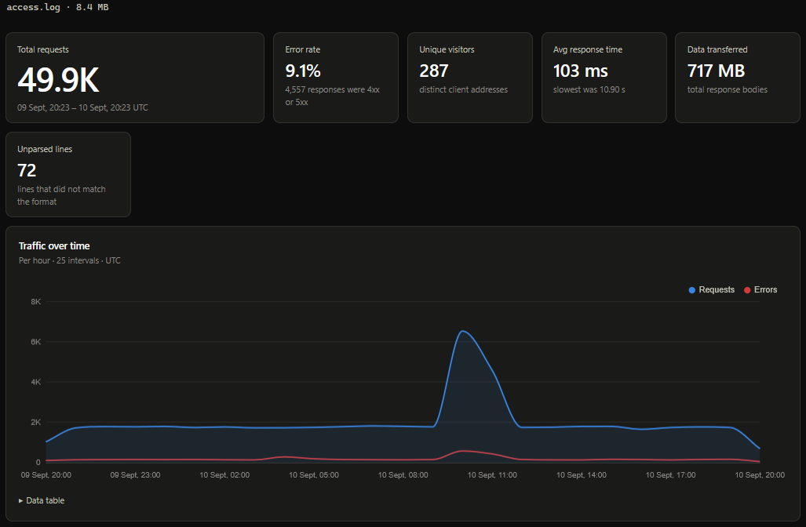

# Log Analyzer

A small web app for exploring nginx and Apache access logs. Upload a log file
and get traffic statistics, status-code breakdowns, error hotspots, response
times, and a timeline of requests.



## Demo

- [Open the application](https://log-analyzer-f5pj.onrender.com)

The demo accepts files up to 50 MB. Logs are analyzed for the current request
and are not saved by the application.

## Features

- Combined and Common Log Format support
- Optional nginx `$request_time` support
- Request, visitor, byte, status, and error statistics
- Most requested endpoints and slowest requests
- Minute, hour, or day traffic timelines
- Drag-and-drop upload with light and dark themes

## Run locally

Requires Python 3.10 or newer.

**Windows (PowerShell)**

```powershell
python -m venv .venv
.venv\Scripts\Activate.ps1
pip install -r requirements.txt
uvicorn app.main:app --reload
```

**macOS/Linux**

```bash
python3 -m venv .venv
source .venv/bin/activate
pip install -r requirements.txt
uvicorn app.main:app --reload
```

Open <http://127.0.0.1:8000> in your browser. To generate a larger test log:

```bash
python scripts/generate_log.py --lines 50000 --hours 24
```

## Supported logs

The default Combined Log Format is accepted:

```text
127.0.0.1 - frank [10/Oct/2000:13:55:36 -0700] "GET /index.html HTTP/1.1" 200 2326 "-" "Mozilla/5.0"
```

Common Log Format is also supported. For response-time analysis, append
nginx's `$request_time` value to each line. Standard access logs without this
field are still analyzed; latency panels are simply marked unavailable.

## API

The API exposes two endpoints:

```text
GET  /api/health
POST /api/analyze
```

`/api/analyze` expects a multipart upload with a field named `file` and returns
the statistics consumed by the dashboard.

## Development

Run the test suite with:

```bash
pytest -v
```

The analysis core is separated from the HTTP layer, so parsing and aggregation
can be tested without starting the server.

## Project structure

```text
app/       parser, analyzer, API models, and FastAPI routes
static/    HTML, CSS, and browser JavaScript
scripts/   synthetic log generator
tests/     parser, analyzer, and API tests
```

## License

[MIT](LICENSE)
